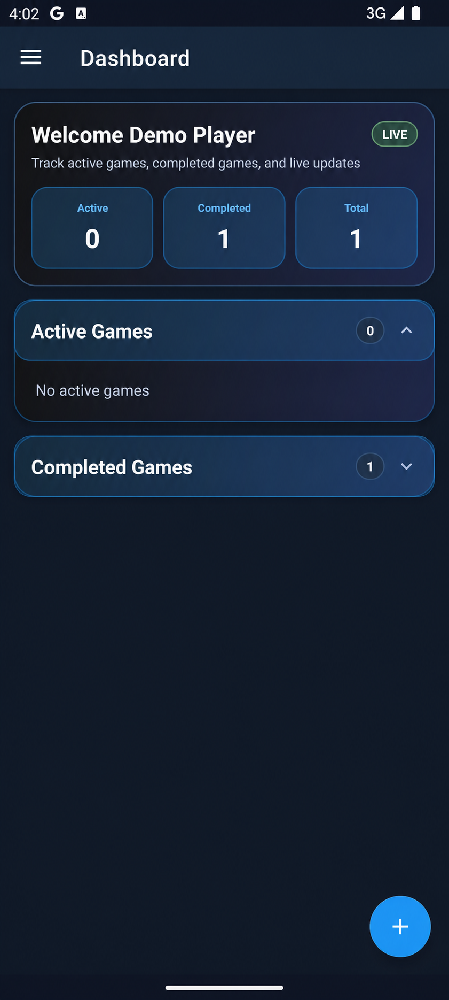
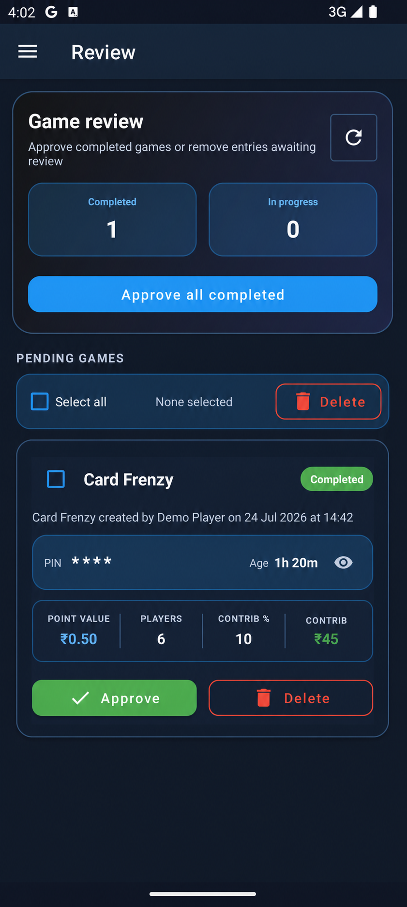

<div align="center">

# RummyPulse

### Live Rummy scoring that keeps every player and every device in sync

Run 10-round games, enter scores safely, calculate settlements, review completed
games, and produce monthly contribution reports from one Android app.

[](https://developer.android.com/about/versions/nougat)
[](https://openjdk.org/projects/jdk/11/)
[](https://firebase.google.com/docs/firestore)
[](https://github.com/debabrata-mandal/RummyPulse/actions/workflows/android-build.yml)

[Download the latest APK](https://github.com/debabrata-mandal/RummyPulse/releases/latest)
·
[View all releases](https://github.com/debabrata-mandal/RummyPulse/releases)

</div>

## App preview

| Dashboard | Admin review |
|---|---|
|  |  |

<sub>Screenshots use sanitized demo names and contain no account identifiers.</sub>

## What RummyPulse does

| Area | Capabilities |
|---|---|
| **Live games** | Create, join, share by PIN or QR code, and follow updates across devices |
| **Score entry** | Enter a full round player by player, preserve unfinished local drafts, then save the round in one write |
| **Settlement** | Track standings, point value, winner contribution, and net amounts |
| **Game access** | Spectator mode plus PIN-protected edit access and corrections |
| **Admin review** | Edit economics, approve completed games, or select and atomically delete multiple games |
| **Reports** | Browse monthly summaries and rebuild a selected month |
| **Administration** | Manage user roles, game defaults, amount visibility, and voice announcements |
| **Updates** | Install releases in-app and enforce a remotely configured minimum supported version |

## Designed for unreliable connections

Firestore persistence keeps previously loaded data available when the network drops.
The app launches immediately for an authenticated user and clearly shows offline
state instead of blocking startup.

| Operation | Offline behavior |
|---|---|
| Open the app and view cached games | Available |
| Continue an unfinished round-score draft | Preserved locally |
| Create a new game | Blocked with a clear connection message |
| Commit scores, approve, or delete games | Requires the server |
| Refresh Remote Config | Fails open; the last activated minimum-version value remains effective |

## Install

RummyPulse is distributed as an APK through GitHub Releases.

1. Download the latest APK from [Releases](https://github.com/debabrata-mandal/RummyPulse/releases/latest).
2. Allow installation from the browser or file manager when Android asks.
3. Open the APK and complete installation.
4. Sign in with a Google account registered for the app.

> RummyPulse is not currently distributed through the Google Play Store.

## Development

### Requirements

- Android Studio with Android SDK 34
- JDK 17 for Gradle and CI
- Android 7.0 or newer device/emulator (API 24+)
- A Firebase Android configuration for `com.example.rummypulse`
- `adb` on `PATH` when using the deploy task

The build toolchain runs on JDK 17; application source compatibility is Java 11.

### Get started

```bash
git clone https://github.com/debabrata-mandal/RummyPulse.git
cd RummyPulse
```

Place your Firebase configuration at:

```text
app/google-services.json
```

Then build and test:

```bash
# macOS / Linux
./gradlew testDebugUnitTest assembleDebug

# Windows
gradlew.bat testDebugUnitTest assembleDebug
```

Install and launch the debug build on a connected device:

```bash
# macOS / Linux
./gradlew deployDebug

# Windows
gradlew.bat deployDebug
```

The debug APK is generated at
`app/build/outputs/apk/debug/app-debug.apk`.

## Firebase configuration

Create a Firebase Android app with package name `com.example.rummypulse`, then:

1. Enable **Google** as a Firebase Authentication provider.
2. Register the signing certificate SHA-1 used by your debug/release build.
3. Enable Cloud Firestore.
4. Enable Remote Config.
5. Deploy [`firestore.rules`](firestore.rules).

### Firestore collections

| Collection | Purpose |
|---|---|
| `games_v2` | Game metadata, status, creator, and access information |
| `gameData_v2` | Players, rounds, scores, and game economics |
| `gameViewApprovals_v2` | Per-user requests and view approvals |
| `approvedGames_v2` | Finalized games moved out of review |
| `approvedGamesReport_v2` | Pre-aggregated monthly reports |
| `gameDefaults_v2` | Shared game defaults |
| `appUser_v2` | User profiles and roles |

### Remote Config

| Parameter | Type | Purpose |
|---|---|---|
| `min_supported_version_code` | Number | Blocks release builds with a lower `versionCode` |
| `update_url` | String | Destination shown on the mandatory-update screen |

Release builds check the last activated value immediately and refresh it in the
background. A successful refresh can enforce a newly raised minimum during the
same session. Network failures do not block startup. Debug builds skip the
mandatory-update gate.

## Optional AI game names

The create-game dialog can suggest short names through Groq. The feature is
optional; builds work without a key.

Configuration is resolved in this order:

1. Gradle property
2. Environment variable
3. Root `local.properties`

```properties
GROQ_API_KEY=gsk_your_key_here
GROQ_MODEL_ID=llama-3.1-8b-instant
```

> The key is compiled into the APK and can be extracted. Use a backend proxy
> before distributing the app to an untrusted audience.

## Architecture

```text
Android Views + Material Components
              │
      Fragments / Activities
              │
     ViewModels + LiveData
              │
          Repositories
              │
Firebase Auth · Firestore · Remote Config
```

```text
app/src/main/java/com/example/rummypulse/
├── data/              Models, policies, repositories, and Firestore access
├── ui/
│   ├── dashboard/     Dashboard and game creation
│   ├── home/          Admin review
│   ├── join/          Live-game ViewModel
│   ├── reports/       Monthly reporting
│   ├── gamedefaults/  Shared configuration
│   └── usermanagement/
├── utils/             Auth, updates, version gate, network, and UI helpers
├── JoinGameActivity.java
├── LoginActivity.java
└── MainActivity.java
```

| Component | Technology |
|---|---|
| UI | Android Views, ViewBinding, Material Components |
| State | MVVM, ViewModel, LiveData |
| Backend | Firebase Authentication, Firestore, Remote Config |
| Navigation | Navigation Component and navigation drawer |
| Build | Gradle Kotlin DSL, Android Gradle Plugin 8.13 |
| Tests | JUnit 4 |

## Release workflow

The `Android Build and Release` workflow runs for pull requests and pushes to
`main`. A push to `main` builds a signed APK and publishes a GitHub Release.

The first line of the commit message controls semantic versioning:

| Prefix | Version change |
|---|---|
| `feat:` or `feature:` | Minor |
| `fix:`, `bugfix:`, or `hotfix:` | Patch |
| `chore:`, `docs:`, `style:`, `refactor:`, `perf:`, or `test:` | Patch |
| Breaking-change marker | Major |

Required repository secrets:

- `GOOGLE_SERVICES_JSON`
- `RELEASE_KEYSTORE_BASE64`
- `GROQ_API_KEY` and `GROQ_MODEL_ID` (optional)

## License

No license file is currently included in this repository.

## Maintainer

[Debabrata Mandal](https://github.com/debabrata-mandal)
